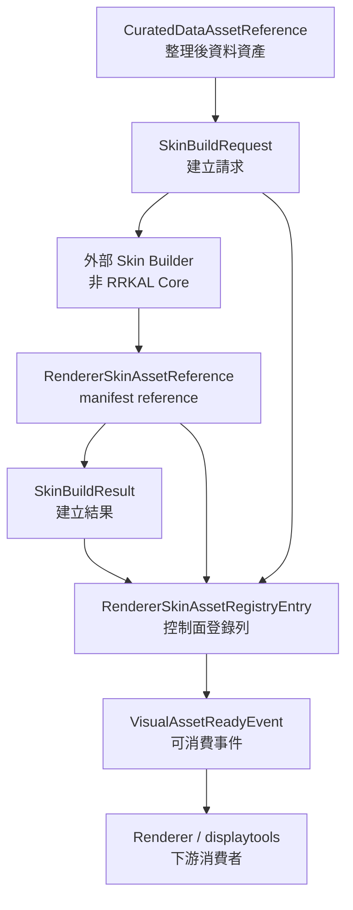

# Visual / Skin Asset Contract

最後更新：2026-06-02

這份文件定義 RRKAL Core 對未來 renderer-ready / skin asset 的控制面契約。它是 `api_launcher/visual_asset_contracts.py` 的人類可讀說明，目的不是實作 renderer、壓縮器或皮層生成器。

一句話邊界：

> RRKAL Core 管資產生命週期、manifest reference、lineage 與 job status，不管資產怎麼畫。

## 目前定位

RRKAL Core 目前只需要知道一個 visual / skin asset：

- 在哪裡：manifest path。
- 從哪來：source request、curated data asset、dataset uid。
- 誰生成：external builder / future skin builder id。
- 是否可信：checksum、size、review flag、warning code。
- 狀態如何：planned / building / ready / failed / review_required / rejected / consumed_by_renderer。
- 哪個 renderer 可消費：renderer targets。

RRKAL Core 目前不需要，也不得做：

- import `RRKAL_displaytools`。
- import `rrkal-visual-compressor`。
- import `vis_2_dis`。
- 讀 `.npz`、GPU buffer、Taichi / Qt payload、renderer project file。
- 做 skin compression、renderer preview、GPU/Qt/Taichi 操作。
- 把 visual asset registry 寫入正式資料庫。這一層目前仍是 contract surface。

## 資料流

這張圖裡只有 Builder 和 Renderer 是下游實作者。RRKAL Core 只保存 request、result、reference、registry entry 與 ready event。

## Contract 類型

| 類型 | 責任 | 明確不做 |
| --- | --- | --- |
| `CuratedDataAssetReference` | 指向 RRKAL 已整理資料資產，保存 curated id、dataset uid、provider、manifest path、checksum。 | 不打開 raw payload，不重新匯入資料。 |
| `SkinBuildRequest` | 描述外部 builder 應建立什麼 skin asset、目標 renderer、profile、bounds signature、review flag。 | 不排程真正 builder，不做壓縮或 renderer 操作。 |
| `RendererSkinAssetReference` | 指向 renderer-ready skin manifest，保存 skin id、source request id、source curated asset id、manifest path、status、targets、checksum。 | 不讀 `.npz`、tile、GPU buffer 或 renderer project。 |
| `SkinBuildResult` | 記錄一次 build request 的結果、warning、review_required、可選 skin reference。 | 不代表 RRKAL Core 已經建出 payload。 |
| `VisualAssetReadyEvent` | 當某個 skin reference 可供下游消費時，輸出 structured event。 | 不呼叫 renderer，不直接載入 renderer。 |
| `RendererSkinAssetRegistryEntry` | 登錄一筆 renderer-ready manifest reference，串接 skin asset、source request、latest build result、review flag、metadata。 | 不做 database persistence，不讀 renderer payload。 |
| `visual_asset_registry_summary()` | 彙總 registry entries 的 status count、ready count、review count、renderer target count。 | 不掃 manifest 內容，不做 payload health check。 |
| `renderer_skin_asset_manifest_projection()` | 把 registry entry 投影成 compact cross-project manifest reference，給 event log、displaytools 或 future builder 讀取。 | 不輸出完整 source request internals，不讀或嵌入 renderer payload。 |

## Lifecycle 狀態

| 狀態 | 意義 |
| --- | --- |
| `planned` | 已規劃建立，但尚未開始。 |
| `building` | 外部 builder 正在處理。 |
| `ready` | manifest reference 可供 renderer 消費。 |
| `failed` | 建立失敗。 |
| `review_required` | 需要人工或 adapter review。 |
| `rejected` | 審核拒絕或不應使用。 |
| `consumed_by_renderer` | 已被某個 renderer 消費或登記使用。 |

未知 lifecycle status 會 fail-fast。這是 contract boundary，不是 UI 自行猜測。

## Lineage Guard

`RendererSkinAssetRegistryEntry` 目前已驗證這些 lineage 一致性：

- `source_request.request_id` 必須等於 `skin_asset.source_request_id`。
- `source_request.source_asset.curated_asset_id` 若存在，必須等於 `skin_asset.source_curated_asset_id`。
- `latest_build_result.request_id` 必須等於 `skin_asset.source_request_id`。
- `latest_build_result.skin_asset.skin_asset_id` 若存在，必須等於 `skin_asset.skin_asset_id`。

目前不強制 `latest_build_result.lifecycle_status` 必須等於 `skin_asset.lifecycle_status`。理由是 registry entry 未來可能保存「上一版 ready skin asset」與「最新一次 failed rebuild result」。

## 已驗證能力

目前已由 tests / smoke / CI 驗證：

- Contract dataclass serialization。
- Lifecycle vocabulary 與未知 status fail-fast。
- `skin_asset_status_label()` 的 UI-neutral display label。
- Registry entry 不輸出 payload bytes、不讀 `.npz`。
- Registry summary 的 lifecycle / renderer target / review count。
- Registry entry lineage mismatch fail-fast。
- Compact manifest projection 只輸出 manifest reference、lineage、renderer target、status 與 safety flags。
- Contract module 不 import `RRKAL_displaytools`、`rrkal-visual-compressor`、`vis_2_dis`、Taichi、PyQt。
- Project maturity renderer row 保持 `contract_only` / `🚧`，並輸出 registry contract 與 empty summary。

最近驗證證據：

- `py -3 -B -m unittest tests.test_visual_asset_contracts tests.test_project_maturity -v`
- `.\scripts\pre_push_smoke_brief.cmd`
- GitHub Actions manual run `26779213359`

## 尚未實作

這些不是目前已交付功能：

- 真正 visual asset registry persistence。
- skin builder。
- `RendererSkinAsset` payload reader。
- `.npz` / tile / GPU buffer inspection。
- displaytools / visual-compressor / vis_2_dis runtime integration。
- renderer preview。
- Qt / Taichi / GPU path。

若 UI 或成熟度矩陣顯示這些能力，必須標為 `🚧`、`contract_only`、`planned` 或 `review_required`，不得寫成穩定功能。

## 下一步

安全的後續切片：

1. 定義 registry persistence OpenSpec，先規格化資料庫欄位與 migration guard。
2. 把 `VisualAssetReadyEvent` 接到 event log，但仍只寫 manifest reference。
3. 與 displaytools / compressor 透過 `L:\AGENT_EXCHANGE` 或正式 OpenSpec 對齊欄位，不直接 import 對方 repo。
4. 若下游需要更多欄位，先版本化 projection schema，不要讓 downstream 直接依賴 `entry.to_dict()` 的完整內部形狀。

不建議下一步：

- 把 renderer 讀檔或 `.npz` parsing 放進 RRKAL Core。
- 為了展示把 displaytools / compressor import 進 launcher。
- 用一份未驗證 JSON 當成正式 renderer manifest spec。
- 把 contract-only 能力寫進 user guide 當可操作流程。
