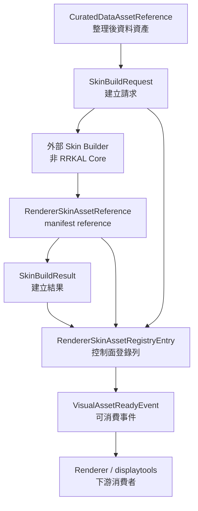

# Visual / Skin Asset Contract

最後更新：2026-06-02

這份文件定義 RRKAL Core 對未來 renderer-ready / skin asset 的控制面契約。它是 `api_launcher/visual_asset_contracts.py` 的人類可讀說明，目的不是實作 renderer、壓縮器或皮層生成器。

一句話邊界：

> RRKAL Core 管資產生命週期、manifest reference、lineage 與 job status，不管資產怎麼畫。

## 目前定位

RRKAL Core 目前只需要知道一個 visual / skin asset：

- 在哪裡：manifest path。
- 從哪來：source request、curated data asset、dataset uid。
- 誰生成：external builder / future skin builder id。
- 是否可信：checksum、size、review flag、warning code。
- 狀態如何：planned / building / ready / failed / review_required / rejected / consumed_by_renderer。
- 哪個 renderer 可消費：renderer targets。

RRKAL Core 目前不需要，也不得做：

- import `RRKAL_displaytools`。
- import `rrkal-visual-compressor`。
- import `vis_2_dis`。
- 讀 `.npz`、GPU buffer、Taichi / Qt payload、renderer project file。
- 做 skin compression、renderer preview、GPU/Qt/Taichi 操作。
- 把 visual asset registry 寫入正式資料庫。這一層目前仍是 contract surface。

## 資料流

這張圖裡只有 Builder 和 Renderer 是下游實作者。RRKAL Core 只保存 request、result、reference、registry entry 與 ready event。

## Contract 類型

| 類型 | 責任 | 明確不做 |
| --- | --- | --- |
| `CuratedDataAssetReference` | 指向 RRKAL 已整理資料資產，保存 curated id、dataset uid、provider、manifest path、checksum。 | 不打開 raw payload，不重新匯入資料。 |
| `SkinBuildRequest` | 描述外部 builder 應建立什麼 skin asset、目標 renderer、profile、bounds signature、review flag。 | 不排程真正 builder，不做壓縮或 renderer 操作。 |
| `RendererSkinAssetReference` | 指向 renderer-ready skin manifest，保存 skin id、source request id、source curated asset id、manifest path、status、targets、checksum。 | 不讀 `.npz`、tile、GPU buffer 或 renderer project。 |
| `SkinBuildResult` | 記錄一次 build request 的結果、warning、review_required、可選 skin reference，並在沒有 skin asset 時仍輸出 lifecycle display profile。 | 不代表 RRKAL Core 已經建出 payload。 |
| `VisualAssetReadyEvent` | 當某個 skin reference 可供下游消費時，輸出 structured event。 | 不呼叫 renderer，不直接載入 renderer。 |
| `RendererSkinAssetRegistryEntry` | 登錄一筆 renderer-ready manifest reference，串接 skin asset、source request、latest build result、review flag、metadata。 | 不做 database persistence，不讀 renderer payload。 |
| `visual_asset_registry_summary()` | 彙總 registry entries 的 status count、ready count、review count、renderer target count，並輸出每個 lifecycle status 的 display profile。 | 不掃 manifest 內容，不做 payload health check。 |
| `renderer_skin_asset_manifest_projection()` | 把 registry entry 投影成 compact cross-project manifest reference，給 event log、displaytools 或 future builder 讀取。 | 不輸出完整 source request internals，不讀或嵌入 renderer payload。 |
| `visual_asset_ready_event_from_registry_entry()` | 從 `ready` registry entry 產生 `VisualAssetReadyEvent`，自動帶入 source request lineage 與 registry metadata。 | 不對非 `ready` asset 發 ready event，不寫入 runtime event log。 |
| `visual_asset_ready_event_log_context()` | 把 `VisualAssetReadyEvent` 投影成 bounded event-log context，白名單輸出 manifest reference、lineage、status、renderer targets 與 safety flags。 | 不直接呼叫 `log_event()`，不輸出任意 metadata、secret、payload bytes 或 renderer internals。 |
| `log_visual_asset_ready_event()` | 顯式把 `VisualAssetReadyEvent` 寫入 RRKAL event log，使用 bounded context 且支援注入 test logger。 | 不在 import 時寫 log，不自動訂閱 lifecycle，不寫任意 metadata 或 renderer payload。 |
| `log_visual_asset_ready_registry_entry()` | 從 `ready` registry entry 建立 ready event，再用同一個 bounded writer 寫入 RRKAL event log。 | 不接受非 `ready` entry，不接 registry persistence，不自動監聽 lifecycle，也不讀 renderer payload。 |
| `log_visual_asset_ready_from_owned_test_database()` | 從明確 acknowledged 的 RRKAL owned test registry DB 讀取指定 persisted ready entry，經 duplicate policy 檢查後顯式寫入 `visual_asset_ready` event。 | 不在 ordinary table write/upsert 時自動發 event；不接受非 owned DB，不讀 renderer payload，預設拒絕同一 registry entry / skin asset 的重複 ready event。 |
| `skin_asset_status_display_profile()` | 把 lifecycle status 轉成 UI-neutral `status_icon`、`display_tone`、`display_label`、`next_action` 與 readiness flags。 | 前端不需要自己推論 planned/building/review_required 是否施工中，也不代表 renderer payload 已實作。 |
| `visual_asset_registry_persistence_schema()` | 定義未來 `visual_skin_asset_registry` 的欄位、index、allowed status 與 migration guard。 | 不建立資料表、不連 DB、不自動發 event、不讀 renderer payload。 |
| `visual_asset_registry_entry_persistence_record()` | 把 registry entry 投影成符合 persistence schema 的扁平 row，並序列化 renderer targets / bounded metadata。 | 不寫 DB、不執行 migration、不保存 payload / secret / token 類 metadata。 |
| `visual_asset_registry_sqlite_ddl_preview()` | 依據 persistence schema 產生可審閱的 SQLite `CREATE TABLE` / `CREATE INDEX` dry-run SQL。 | 不連 SQLite、不建立資料表、不寫檔、不自動發 event；正式 migration 仍需 explicit guard。 |
| `create_visual_asset_registry_table_for_owned_test_database()` | 只在明確 `allow_owned_test_database=True` 的 RRKAL owned test SQLite DB 中 materialize registry table 與 marker table。 | 不可作產品 migration；拒絕已有非 owned marker 的 SQLite DB，不寫使用者資料庫、不發 event、不讀 renderer payload。 |
| `write_visual_asset_registry_entry_for_owned_test_database()` | 只在明確 `allow_owned_test_database=True` 的 RRKAL owned test SQLite DB 中 upsert 一筆 registry row，且 row shape 來自 `visual_asset_registry_entry_persistence_record()`。 | 不可作產品 repository write；拒絕未 opt-in / 非 owned DB，不自動發 ready event，不讀 renderer payload。 |
| `read_visual_asset_registry_entry_for_owned_test_database()` | 只從 RRKAL owned test SQLite DB 讀回一筆 `RendererSkinAssetRegistryEntry` object，供 explicit workflow / CLI 進一步處理。 | 不寫 event、不掃使用者 DB；沒有 owned marker 時拒絕，不讀 manifest / `.npz` / renderer payload。 |
| `read_visual_asset_registry_entry_payload_for_owned_test_database()` | 只從 RRKAL owned test SQLite DB 讀回一筆 `RendererSkinAssetRegistryEntry` 相容 control-plane payload。 | 不可掃使用者 DB；沒有 owned marker 時拒絕，不讀 manifest / `.npz` / renderer payload。 |
| `list_visual_asset_registry_entry_payloads_for_owned_test_database()` | 只從 RRKAL owned test SQLite DB 列出 registry control-plane payloads。 | 不可作正式 UI repository list；沒有 owned marker 時拒絕，不觸發 lifecycle event。 |
| `visual_asset_registry_summary_for_owned_test_database()` | 只從 RRKAL owned test SQLite DB 讀取 registry rows 並回傳 lifecycle counts、status display profiles、review count、renderer target counts 與 safety flags。 | 不可作正式 UI repository summary；沒有 owned marker 時拒絕，不讀 manifest / `.npz` / renderer payload，不 import 下游專案。 |
| `visual_asset_registry_owned_test_drop_preview()` | 只針對 RRKAL owned test SQLite DB 產生 rollback/drop SQL preview。 | 只 dry-run，不執行 DROP；沒有 owned marker 時拒絕，不提供使用者 DB destructive path。 |

## Lifecycle 狀態

| 狀態 | 意義 |
| --- | --- |
| `planned` | 已規劃建立，但尚未開始。 |
| `building` | 外部 builder 正在處理。 |
| `ready` | manifest reference 可供 renderer 消費。 |
| `failed` | 建立失敗。 |
| `review_required` | 需要人工或 adapter review。 |
| `rejected` | 審核拒絕或不應使用。 |
| `consumed_by_renderer` | 已被某個 renderer 消費或登記使用。 |

未知 lifecycle status 會 fail-fast。這是 contract boundary，不是 UI 自行猜測。

## Lineage Guard

`RendererSkinAssetRegistryEntry` 目前已驗證這些 lineage 一致性：

- `source_request.request_id` 必須等於 `skin_asset.source_request_id`。
- `source_request.source_asset.curated_asset_id` 若存在，必須等於 `skin_asset.source_curated_asset_id`。
- `latest_build_result.request_id` 必須等於 `skin_asset.source_request_id`。
- `latest_build_result.skin_asset.skin_asset_id` 若存在，必須等於 `skin_asset.skin_asset_id`。

目前不強制 `latest_build_result.lifecycle_status` 必須等於 `skin_asset.lifecycle_status`。理由是 registry entry 未來可能保存「上一版 ready skin asset」與「最新一次 failed rebuild result」。

## 已驗證能力

目前已由 tests / smoke / CI 驗證：

- Contract dataclass serialization。
- Lifecycle vocabulary 與未知 status fail-fast。
- `skin_asset_status_label()` 的 UI-neutral display label。
- Registry entry 不輸出 payload bytes、不讀 `.npz`。
- Registry summary 的 lifecycle / renderer target / review count。
- Registry summary 會輸出 status display profiles，讓 dashboard 不必自行把 status count 轉成 UI 文案。
- Registry entry lineage mismatch fail-fast。
- Compact manifest projection 只輸出 manifest reference、lineage、renderer target、status 與 safety flags。
- Ready-event factory 只接受 `ready` registry entry，避免對 review / failed asset 發出可消費事件。
- Ready-event log context 只輸出 bounded manifest reference 與白名單 metadata，避免任意 metadata、secret 或 payload bytes 進入 event log。
- Ready-event log writer 只在顯式呼叫時寫入 `visual_asset_ready` event，並使用同一份 bounded context。
- Registry-entry ready-event writer 只接受 `ready` entry，會先經過 ready-event factory，再寫入 bounded event log。
- Persisted-entry ready-event writer / CLI 只在顯式呼叫時從 RRKAL owned test DB 讀取指定 ready entry；預設 duplicate policy 會拒絕同一 registry entry 或 skin asset 的重複 `visual_asset_ready` event，除非明確使用 allow-duplicate path。
- Lifecycle display profile 會把 `planned`、`building`、`review_required` 標成施工中 / review 類 tone，讓 Tk / Web / 未來 Qt 直接消費後端顯示契約。
- `SkinBuildResult` 即使沒有 `skin_asset`，也會輸出 lifecycle display profile，讓 failed / review-required build result 可被 UI 安全顯示。
- Registry persistence schema contract 已輸出 `visual_skin_asset_registry` 欄位、index、lifecycle vocabulary 與 migration guard，並明確標示 `schema_contract_only`、不自動建表、不自動發 event。
- Registry persistence row projection 可把 entry 轉成 schema-aligned flat row，且 bounded metadata 會過濾 payload / secret / token 類 key。
- Registry persistence SQLite DDL preview 可由 schema contract 產生 dry-run `CREATE TABLE` / `CREATE INDEX` SQL，且不連 DB、不建表、不包含 payload 欄位；project maturity 仍標示 renderer row 為 `contract_only`。
- Owned test-only table creation helper 需要明確 `allow_owned_test_database=True`；它會建立 RRKAL marker table、materialize registry table/index，並拒絕已有非 owned marker 的 SQLite DB。
- Owned test-only write/read/list helpers 需要明確 `allow_owned_test_database=True`；write 會消費 schema-aligned persistence record，read/list 會回傳 registry-entry object 或相容 control-plane payload，並保持 `auto_event_emission=false` / `payload_loading=false`。
- Owned test-only rollback/drop preview 需要明確 `allow_owned_test_database=True` 與 owned marker；它只回傳 DROP preview statements，並保持 `destructive_execution_enabled=false` / `mutates_database_state=false`。
- Owned test-only read-side summary helper 需要明確 `allow_owned_test_database=True` 與 owned marker；它只輸出 lifecycle counts、status display profiles、review count、renderer target counts 與 safety flags，並保持 `auto_event_emission=false` / `payload_loading=false`。
- Contract module 不 import `RRKAL_displaytools`、`rrkal-visual-compressor`、`vis_2_dis`、Taichi、PyQt。
- Project maturity renderer row 保持 `contract_only` / `🚧`，並輸出 registry contract 與 empty summary。

最近驗證證據：

- `py -3 -B -m unittest tests.test_visual_asset_contracts tests.test_project_maturity -v`
- `.\scripts\pre_push_smoke_brief.cmd`
- Full smoke `state\logs\pre_push_smoke_20260602_065359.log`：1069 tests / 4 skipped，MVP demo `download_import_completed` / `row_count=3`
- GitHub Actions manual run `26787163638`（owned test table helper checkpoint，Ubuntu / Windows / real DB smoke 通過）。

## 尚未實作

這些不是目前已交付功能：

- 真正 visual asset registry persistence。
- 正式使用者 DB migration / repository write-read-list。
- 真正 visual asset registry migration / 使用者 DB table creation / repository write-read。
- skin builder。
- `RendererSkinAsset` payload reader。
- `.npz` / tile / GPU buffer inspection。
- displaytools / visual-compressor / vis_2_dis runtime integration。
- renderer preview。
- Qt / Taichi / GPU path。

若 UI 或成熟度矩陣顯示這些能力，必須標為 `🚧`、`contract_only`、`planned` 或 `review_required`，不得寫成穩定功能。

## 下一步

安全的後續切片：

1. 若要真正落地 registry persistence，先由 `visual_asset_registry_sqlite_ddl_preview()` 審閱 migration SQL，再消費 `visual_asset_registry_persistence_schema()` 與 `visual_asset_registry_entry_persistence_record()`，不得讓 repository layer 自行發明欄位或 row shape；正式 DB 路徑不能直接沿用 owned test helper 的 opt-in。
2. 若要把 owned test-only explicit event CLI 推進到正式 repository workflow，必須先定義正式 DB ownership / migration guard 與 duplicate-event policy 的持久化策略；不得讓 table write/upsert 自動發 event。
3. 與 displaytools / compressor 透過 Notion `Agents討論區` 的 coordination route、`o_1` review 或正式 OpenSpec 對齊欄位，不直接 import 對方 repo；`L:\AGENT_EXCHANGE` 只作歷史封存參考。
4. 若下游需要更多欄位，先版本化 projection schema，不要讓 downstream 直接依賴 `entry.to_dict()` 的完整內部形狀。

不建議下一步：

- 把 renderer 讀檔或 `.npz` parsing 放進 RRKAL Core。
- 為了展示把 displaytools / compressor import 進 launcher。
- 用一份未驗證 JSON 當成正式 renderer manifest spec。
- 把 contract-only 能力寫進 user guide 當可操作流程。
